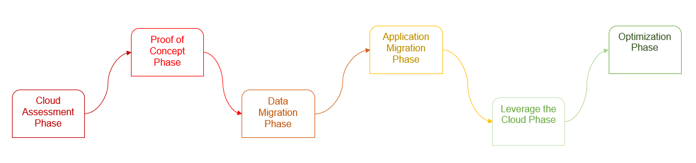
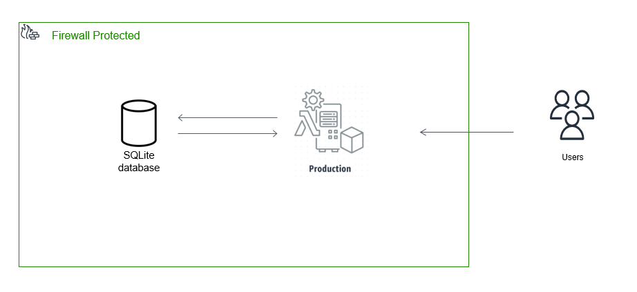
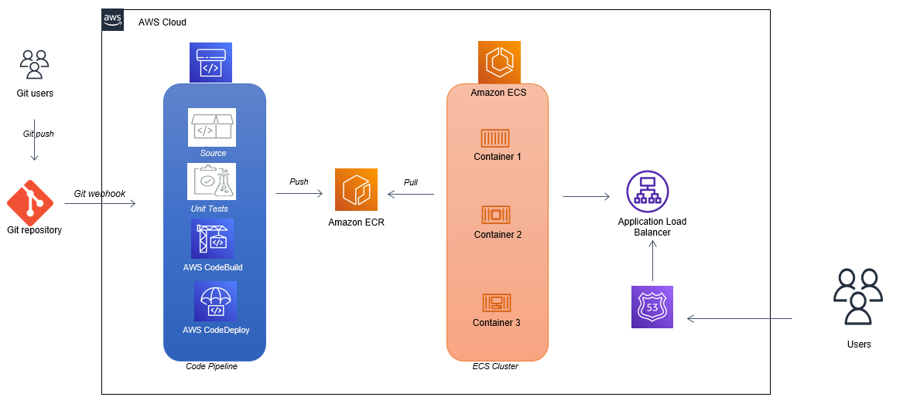

# Migration of notejam app to AWS-Cloud
- [1. Introduction](#1-introduction)
- [2. Migration Roadmap](#2-migration-roadmap)
- [3. Infrastructure](#3-infrastructure)
- [4. Outputs](#4-outputs)
    - [Solution Document](#solution-document)
    - [Artifacts](#artifacts)
    - [Working Solution](#working-solution)    
- [5. Challenges and Solutions](#5-challenges-and-solutions)    
- [6. Conclusion](#6-conclusion)
--------------------------------------------

## 1. Introduction
### What to migrate
An On-premise Monolithic Web Application Architecture.
Notejam web application allows user to sign up/in/out and create/view/edit/delete notes.
### What to solve
Application is designed to be easy to build and run locally. It is identified as not an optimal architecture to meet the business requirements.
### What to achieve
Neet a new infrastructure design which can offer:

    - Dynamic Scalability 
    - Data durability
    - Availability
    - CI / CD
    - Ensuring parity between Dev, Test, and Production Environments
    - Security and Monitoring

## 2. Migration Roadmap
Data centre migration to the cloud.  A best-practice migration strategy.

### 1. Cloud Assessment Phase
    - Assess Cost
    - Assess Architecture
    - Assess Security

### 2. Proof of Concept Phase
    - Learn AWS
    - Build a Pilot
    - Build Support within organization

### 3. Data Migration Phase
    - Leverage different storage options
    - Migrate

### 4. Application Migration
    - Forklift Migration
    - Hybrid Migration Strategy

### 5. Leverage the Cloud Phase
    - Auto-scaling
    - Automation
    - Elasticity
    - High Availability

### 6. Optimization Phase
    - Unitilization
    - Monitoring
    - Efficiency
    - Performance
    - Re-engineering

## 3. Infrastructure
### Existing Infrastructure:
A on-premises monolithic application combined together with Database, Web Server and Web Application. 

### Proposed Architecture:
Containerized CI / CD Pipeline using Docker, CodeBuild, ECS Fargate and a LoadBalancer which seperates Database and Web Application.  It also allows developers to choose other tech-stacks.

## Outputs
### Artifacts
All elements which are created as part of the Migration Process such as source-code, scripts and documents.
    
    - [Git Repository]<https://github.com/ganesh35/notejam>
    - [Dockerfile]<https://github.com/ganesh35/notejam/blob/main/Dockerfile>
    - [buildspec.yml]<https://github.com/ganesh35/notejam/blob/main/buildspec.yml>
    - [Cost Estimation]<https://calculator.aws/#/estimate?id=f4f1f3516fd17528ab352dc4bc1a441da6a1f560>
        
### Pilot
A working solution of the deployed notejam
site: https://notejam.butcha.ga
### Tools and Technologies used:
        - GitHub
        - ECR
        - ECS with FARGATE (for container management / orchestration)
        - CodeBuild
        - CodePipeline
        - TargetGroups
        - Load Balancer

## 5. Challenges and Solutions
    Challenge: Source code and their framework versions are obsolete
    Solution: Containerization 
    Result: Achieved supporting current development and allowing the dev-teams to switch between tech-stacks

    Challenge: Parity and communication between Dev, Test and Production environments
    Solution: CI / CD Pipeline
    Result: 
        - Developers can push changes to 'dev' branch on the git repository to run unit tests and can confirm test-ready application.
        - Testers can run automated/customized tests on test-ready application.
        - Pushing changes to branch 'master' on git repository deploys application on production environment.

## 6. Conclusion
- Faster Deployment Times
- Greater Flexibility and Collaboration for Dev and Test Teams
- Less Infrastructure Complexity
- Improved Cost Management
- Security, reliability, scalability, and availability
- Data durability

* [Twitter Bootstrap] - great UI boilerplate for modern web apps

[//]: # References
[Twitter Bootstrap]: <http://twitter.github.com/bootstrap/>

