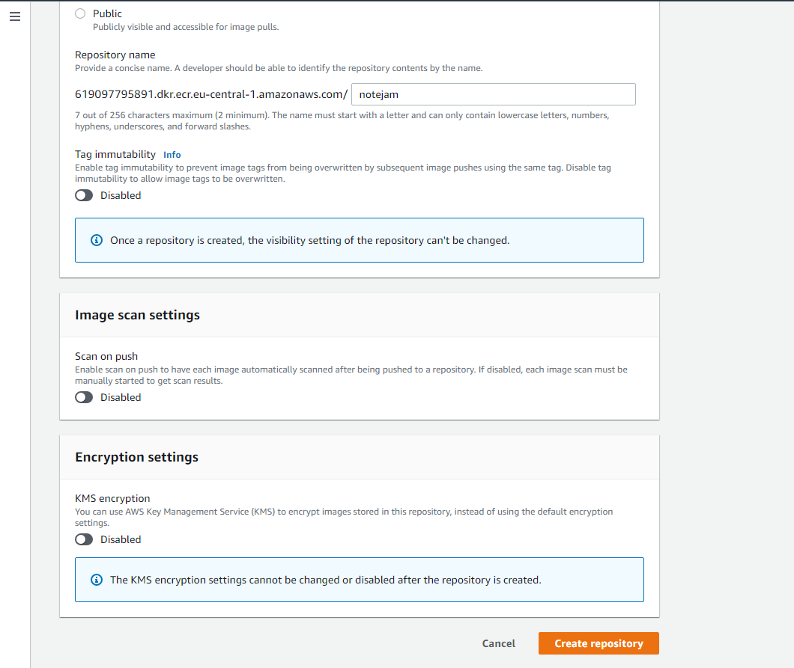
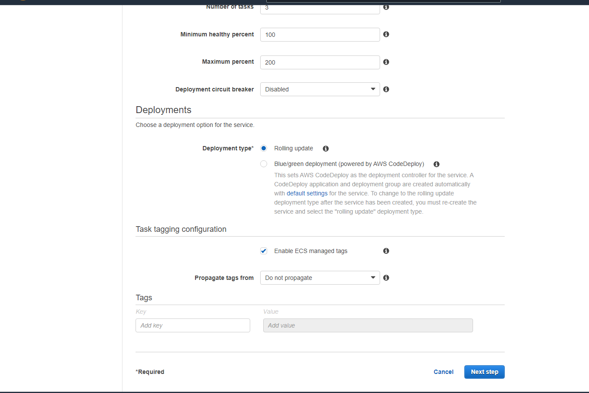
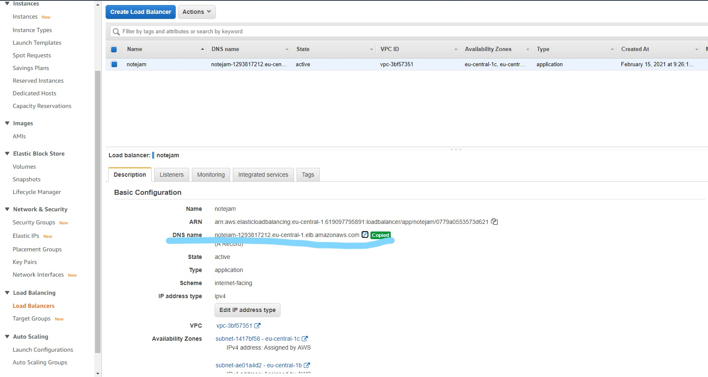

# Implementing Dockarized application on AWS with ECS and CI/CD Pipeline.

- [1. Preparing Sourcecode](#1-preparing-source-code)
- [2. Dockerizing the application](#2-dockerizing-the-application)
- [3. ECR Repository](#3-ecr-repository)
- [4. ECS Cluster](#4-ecs-cluster)
- [5. Task Definition](#5-task-definition)
- [6. Target Groups](#6-target-groups)
- [7. Load Balancer](#7-load-balancer)
- [8. Cluster Service](#8-cluster-service)
- [9. CodeBuild Project](#9-codebuild-project)
- [10. CodePipeline for CI / CD](#10-codepipeline-for-ci-cd)
- [11. Conclusion](#11-conclusion)
--------------------------------------------

## 1. Preparing Source code
Example Folder Structure for a Dockerized application:

Folder structure:
```bash
├── code                                # source code goes here, Django in this case
├── Dockerfile                          # Dockerfile to build docker image
├── buildspec.yml                       # Build specification for AWS CodeBuild
├── requirements.txt                    # dependency file for Django packages
├── docker-entrypoint.sh                # Entrypoint scripts for Data definitions, migrations, and Unit tests
└── READMEM.rst                         # Basic informatino
```

### Create necessary files and folders
```sh
mkdir code
touch Dockerfile buildspec.yml docker-entrypoint.sh
```
### Copy files
- Copy folder <https://github.com/nordcloud/notejam/tree/master/django/notejam> to code in target directory
- Copy <https://github.com/nordcloud/notejam/edit/master/django/README.rst> to README.rst
- Copy <https://github.com/nordcloud/notejam/edit/master/django/requirements.txt> to requirements.txt


### Create entrypoint file
File: docker-entrypoint.sh
```sh
#!/bin/bash
# Collect static files
echo "Collect static files"
python manage.py syncdb --noinput

# Apply database migrations
echo "Apply database migrations"
python manage.py migrate

# Running Tests
echo "Running Tests"
python manage.py test

# Start server
echo "Starting server"
python manage.py runserver 0.0.0.0:80
```

## 2. Dockerizing the application

### Update Dockerfile with the below contents
```dockerfile
#FROM python:2.7
FROM 619097795891.dkr.ecr.eu-central-1.amazonaws.com/python:2.7
ENV VIRTUAL_ENV=/opt/venv
RUN virtualenv $VIRTUAL_ENV -p python2.7
ENV PATH="$VIRTUAL_ENV/bin:$PATH"

RUN mkdir /code
WORKDIR /code
ADD requirements.txt /code/
COPY ./code /code
RUN pip install -r requirements.txt
RUN pip install mysqlclient

ADD docker-entrypoint.sh /code/
RUN chmod +x /code/docker-entrypoint.sh

EXPOSE 80
ENTRYPOINT ["/code/docker-entrypoint.sh"]
```

### Build and Run Docker container
```sh
sudo docker build -t notejam-django-image .
sudo docker run --name notejam-running-app -p 80:80 notejam-django-image
```
### Step, Rebuild, Run container
```sh
sudo docker stop notejam-running-app; sudo docker rm notejam-running-app; sudo docker run -d --name notejam-running-app -p 80:80 notejam-django-image
```

- Create Git repository and push changes to it (or, clone repository from <https://github.com/ganesh35/notejam> )

----------------------------------
## 3. ECR Repository
Create a new ECR Repository
### Choose 'Create' from ECR 
Choose as Private repository and leave other fields to defaults.

### Click 'create' to complete repository creation

### Copy repository URI and save it for later use:


### Update contents of buildspec.yml with the new URI
```yml
version: 0.2

phases:
  pre_build:
    commands:
      - echo Loggin in to Amazon ECR...
      - aws --version
      - docker --version
      - aws ecr get-login-password --region eu-central-1 | docker login --username AWS --password-stdin 619097795891.dkr.ecr.eu-central-1.amazonaws.com
      # Replace repository URI
      - REPOSITORY_URI=619097795891.dkr.ecr.eu-central-1.amazonaws.com/notejam
      - COMMIT_HASH=$(echo $CODEBUILD_RESOLVED_SOURCE_VERSION | cut -c 1-7)
      - IMAGE_TAG=build-$(echo $CODEBUILD_BUILD_ID | awk -F":" '{print $2}')
      - echo $COMMIT_HASH
      - echo $IMAGE_TAG
      - echo $REPOSITORY_URI
  build:
    commands:
      - echo Build started on `date`
      - echo Building the Docker image...
      - docker build -t $REPOSITORY_URI:latest .
      - docker tag $REPOSITORY_URI:latest $REPOSITORY_URI:$IMAGE_TAG
  post_build:
    commands:
      - echo Build completed on `date`
      - echo Pushing the Docker images...
      - docker push $REPOSITORY_URI:latest
      - docker push $REPOSITORY_URI:$IMAGE_TAG
      - echo Writing image definitions file...
      # Replace name as per ECR repository name
      - printf '[{"name":"notejam", "imageUri":"%s"}]' $REPOSITORY_URI:$IMAGE_TAG > imagedefinitions.json   
      - cat imagedefinitions.json  
artifacts:
  files: 
    - imagedefinitions.json

```

### Run all Push commands to push docker image to ECR


----------------------------------
## 4. ECS Cluster
Create  a Cluster with the below information:
### Choose 'Networking only' template

### Provide 'Custer name' and click 'Create'


----------------------------------
## 5. Task Definition
### Choose 'FARGATE' as launch type compatibility

### Provide a Task Definition name

### Provide a Task size 

### Click on 'Add Container'
  - Provide a 'Container name'
  - Enter ECR Repository URI as Image 
  - add :latest at the end of the Image to make sure it picks up latest version


Leave the rest fields as defaults and click 'Add' to complete.

Click 'create' to complete Task Definition

----------------------------------
## 6. Target Groups
### Create a target group for Load Balancer
Choose Target Group from EC2 section and create a new group


----------------------------------
## 7. Load Balancer
### Create a Load Balancer as per below instructions


----------------------------------
## 8. Cluster Service
### Create a Service under Cluster management

### Select Launch Type as FARGATE

### Leave rest of fields to defaults and click 'Next' to continue

### Following the below steps


Leave rest of the fields to their defaults and click 'Create service' to complete.

----------------------------------
## 9. CodeBuild Project
### Provide a Project name

### Define Source provider

### Define Webhook events
Please select PUSH from Event type dropdown

### Define Environment
Choose Ubuntu as OS and other paramaters as per below image

### Service role
- Create a new service role or use an existing role.
- We have to defined buildspec.yml file as part of our source code.


Leave rest of fields to defaults and click 'Create build project' to complete.
### Service role
Before starting CodeBuild make sure this Service role has policy of 'AmazonEC2ContainerRegistryFullAccess'

### Start build

### Make sure build completes Successfully


### Get Load Balancer DNS Name for testing


### Test


----------------------------------
## 10. CodePipeline for CI / CD

### Pipeline Settings

### Pipeline Source provider

### Build stage

### Deploy stage

### Pipeline overview


----------------------------------
## 11. Conclusion

## Improvements:
  - Route 53 can be configured to use a real domain
  - LoadBalancer can be configured in accoreance with Target Groups to run web service from port 443
## Working Demo
<!-- blank line -->
<figure class="video_container">
  <video controls="true" allowfullscreen="true" poster="imgs/notejam_web.png">
    <source src="imgs/ci_cd.mp4" type="video/mp4">    
  </video>
</figure>
<!-- blank line -->